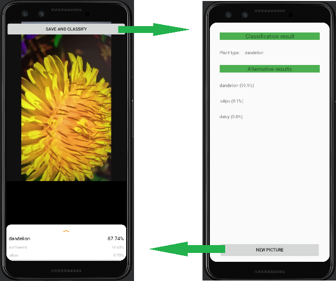
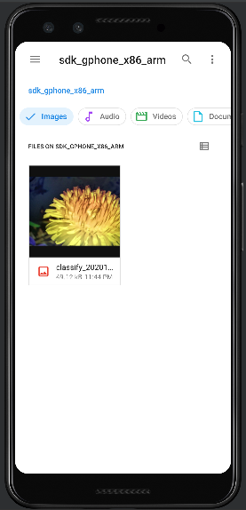

# Proyecto Android

El presente trabajo corresponde al laboratorio proyecto de Android, en el cual se desarrolló una aplicación capaz de identificar flores, mediante el uso de una red neuronal para clasificarlas correctamente. Las imágenes capturadas son almacenadas en la memoria del dispositivo para conveniencia del usuario. Al salvar la imágen se procede a mostrar los resultados de su clasificación, así el usuario puede buscar más detalles de los resultados más probables para identificar adecuadamente la flor de interés.

## Autores
* Daniel Meseguer Wong
* Esteban Valverde Hernández

## Interfaz

La interfaz es sumamente simple y tiene un botón para almacenar y clasificar la flor y en la siguiente pantalla muestra los resultados de la clasificación.

Las imagenes de la clasificación se salvan en la galería, como ejemplo:

## Uso

Para correr la aplicación se recomienda el uso de Android Studio y se debe abrir el proyecto y ejecutarlo. El presente laboratorio se probó y ejecutó en Android Studio para Windows, utilizando el emulador como dispositivo, sin embargo, la aplicación puede ser cargada en un disposito real por medio de Android Studio.

## Referencias

Para el presente proyecto se tomó como base para el proyecto, la infraestructura desarrollada en: https://codelabs.developers.google.com/codelabs/recognize-flowers-with-tensorflow-on-android#0, la cual permitió la integración de la red neuronal.

Se utilizó el collab, disponible en: https://colab.research.google.com/github/tensorflow/examples/blob/master/community/en/flowers_tf_lite.ipynb, para poder entrenar la red neuronal.

